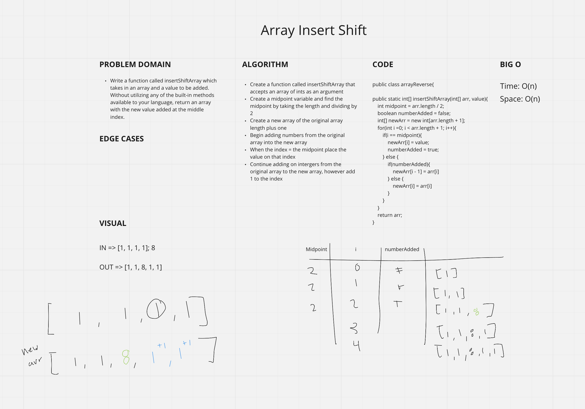

# Reverse an Array
<!-- Description of the challenge -->
- Write a function called insertShiftArray which takes in an array and a value to be added. Without utilizing any of the built-in methods available to your language, return an array with the new value added at the middle index.

## Whiteboard Process
<!-- Embedded whiteboard image -->

## Approach & Efficiency
<!-- What approach did you take? Discuss Why. What is the Big O space/time for this approach? -->
- Time: O(n)
  - The time for my algorithm depends on how big the array is.
  - At worst case scenario will take O(n)

- Space: O(n) (-->ADDITIONAL SPACE <--)
  - My algorithm creates a new array that takes up space as big as n