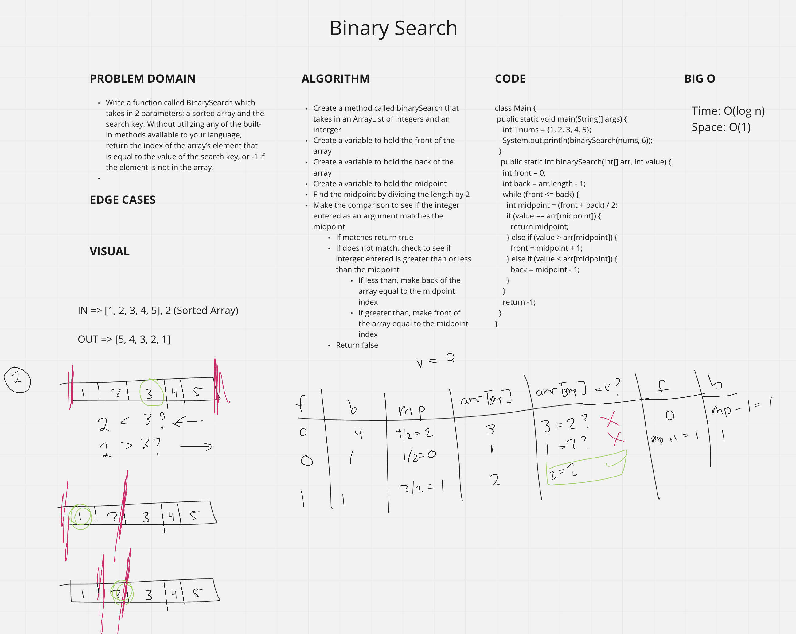

# Binary Search
<!-- Description of the challenge -->
- Write a function called BinarySearch which takes in 2 parameters: a sorted array and the search key. Without utilizing any of the built-in methods available to your language, return the index of the array’s element that is equal to the value of the search key, or -1 if the element is not in the array.

## Whiteboard Process
<!-- Embedded whiteboard image -->

## Approach & Efficiency
<!-- What approach did you take? Discuss Why. What is the Big O space/time for this approach? -->
- Time: O(log n)
  - The algorthm cuts the array in half each iteration

- Space: O(1) (-->ADDITIONAL SPACE <--)
  - Returns a singular boolean statement