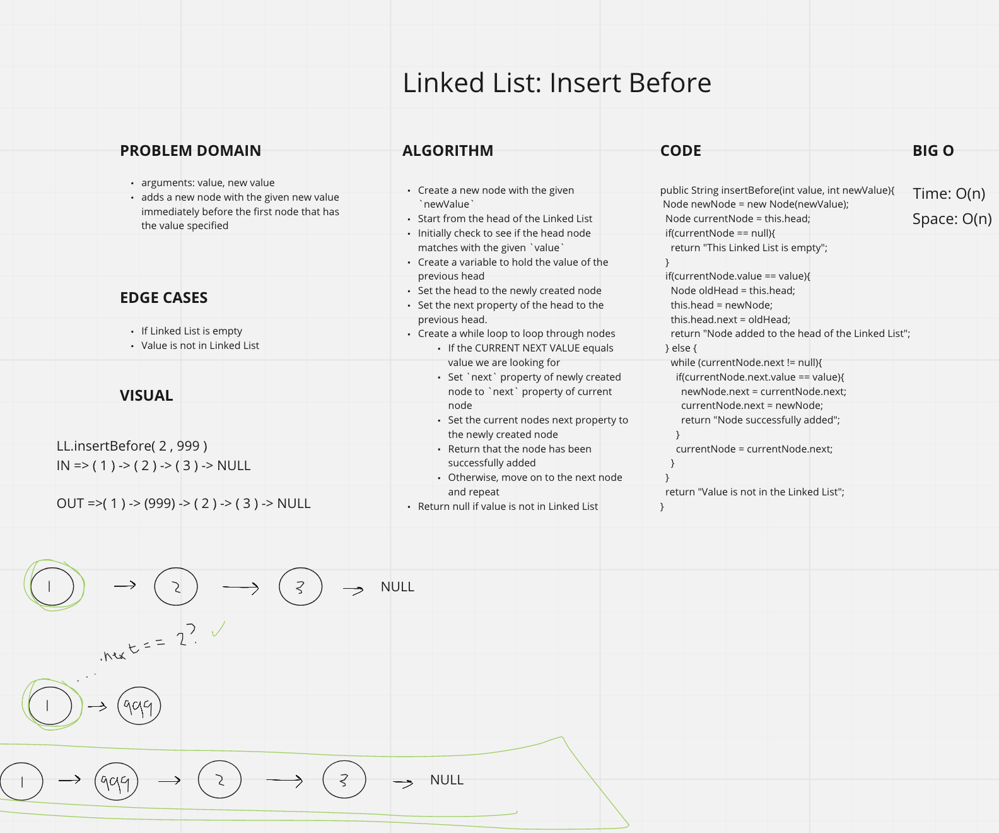
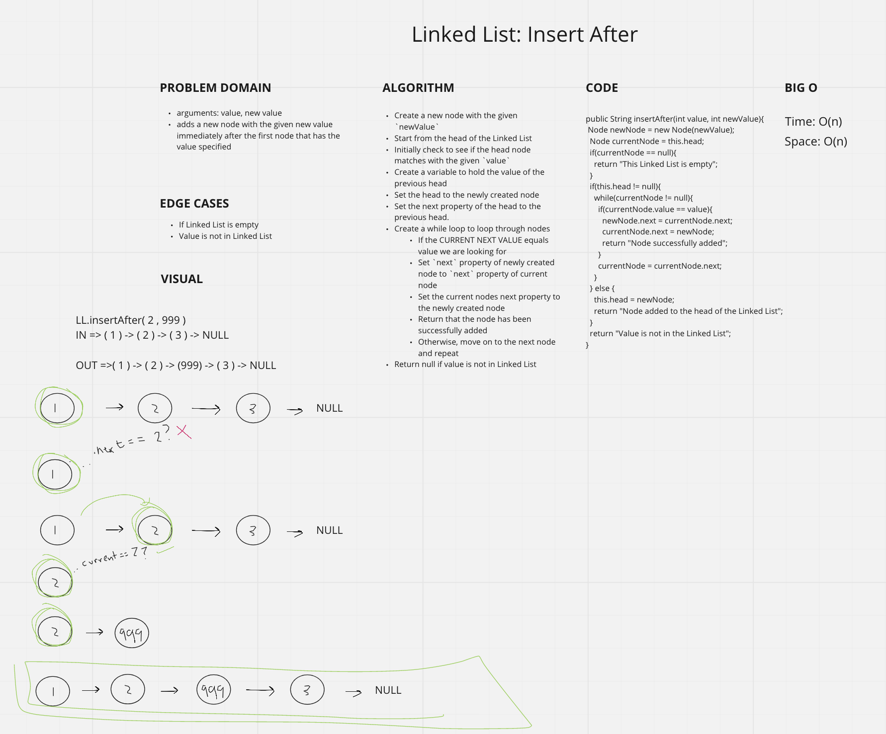
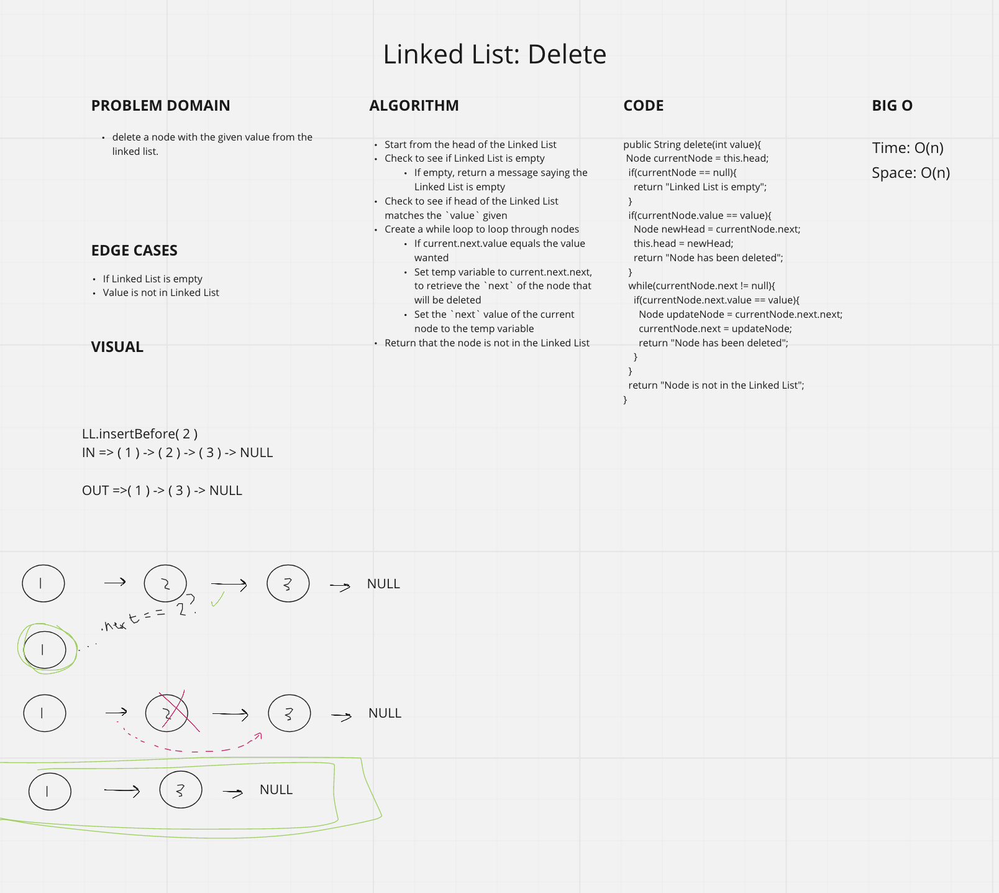
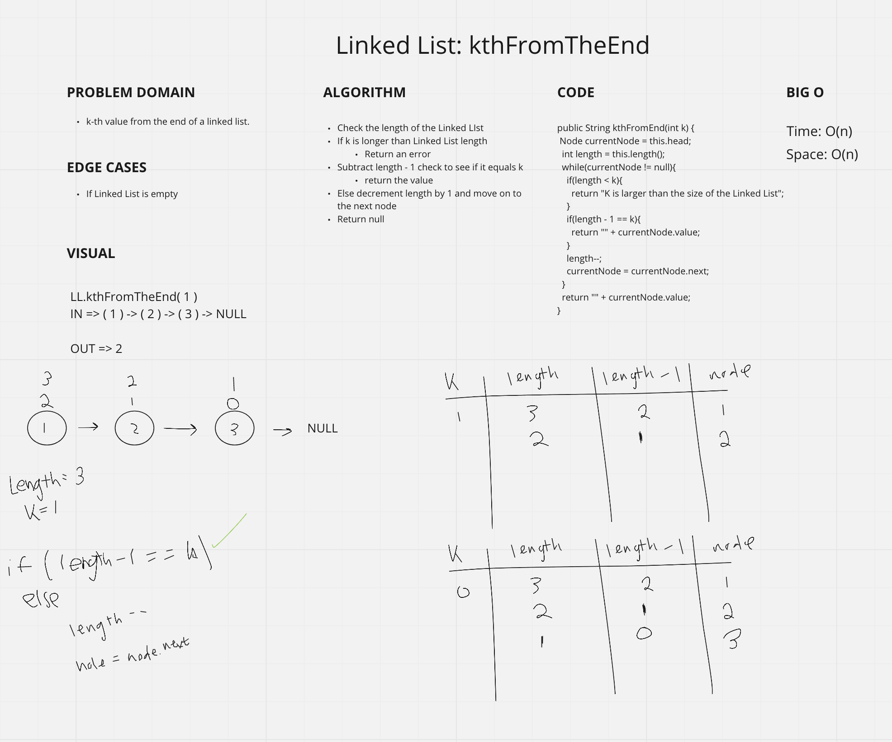
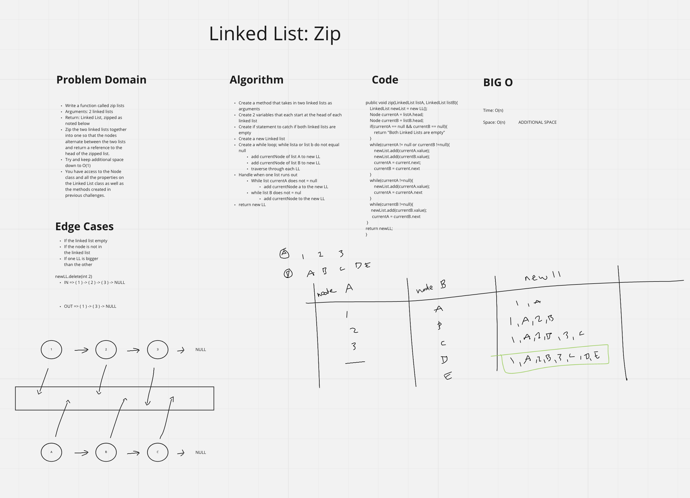

# Singly Linked List
<!-- Short summary or background information -->
- *"A Linked List is a sequence of Nodes that are connected/linked to each other. The most defining feature of a Linked List is that each Node references the next Node in the link.*"
- [Linked List](https://github.com/jennerdulce/reading-notes/blob/main/Java-401-05.md)

## Challenge
<!-- Description of the challenge -->
- The class should contain the following methods

### Create a Linked List class

- Within your Linked List class, include a head property.
- Upon instantiation, an empty Linked List should be created.

### insert

- Arguments: value
- Returns: nothing
- Adds a new node with that value to the head of the list with an O(1) Time performance.

### includes

- Arguments: value
- Returns: Boolean
- Indicates whether that value exists as a Node’s value somewhere within the list.

### toString

- Arguments: none
- Returns: a string representing all the values in the Linked List, formatted as:
- "{ a } -> { b } -> { c } -> NULL"

## Approach & Efficiency
<!-- What approach did you take? Why? What is the Big O space/time for this approach? -->
- `.insert(int)`
  - TIME: O(n)
  - SPACE: O(1)

- `.append(value, newValue)`
  - SPACE: O(n)
  - TIME: O(n)

- `.includes(int)`
  - TIME: O(n)
  - SPACE: O(1)

- `.toString()`
  - TIME: O(n)
  - SPACE: O(n)

- `.delete(value)`
  - SPACE: O(n)
  - TIME: O(n)

- `.insertBefore(value, newValue)`
  - SPACE: O(n)
  - TIME: O(n)

- `.insertAfter(value, newValue)`
  - SPACE: O(n)
  - TIME: O(n)

- `.kthFromEnd(k)`
  - SPACE: O(n)
  - TIME: O(n)

- `.zip(LinkedList, LinkedList)`
  - SPACE: O(n)
  - TIME: O(n)

## API
<!-- Description of each method publicly available to your Linked List -->

### `.insert(int)`

- Construct node with given argument
- Check to see if Linked List is empty
  - If empty add the node to the head of the Linked List
- If not empty:
  - Start at head of Linked List
  - Create a while loop to loop through nodes until it reaches the end of the Linked List
    - Assign node as the current nodes next value

### `.includes(int)`

- Check to see if Linked List is empty
  - If empty return false
- If not empty:
  - Start at head of Linked List
  - Create a while loop to loop through nodes
    - Check to see if the value of this node matches;
    - If the current node's value matches; return true
    - Continue on to the next node if the current node value does not match
  - Return false if value is not matched within the whileloop

### `.toString()`

- Create a new string
- Start from the beginning node
- Create a while loop to loop through nodes
  - Concatenate to the string with the current value node
    - Continue to the next node and repeat
  - Concatenate 'NULL' to the string after the while loop
    - Return the string

### `.insertBefore(int value, int newValue)`

- Create a new node with the given `newValue`
- Start from the head of the Linked List
- Initially check to see if the head node matches with the given `value`
  - Create a variable to hold the value of the previous head
  - Set the head to the newly created node
  - Set the next property of the head to the previous head.
- Create a while loop to loop through nodes
  - If the CURRENT NEXT VALUE equals value we are looking for
    - Set `next` property of newly created node to `next` property of current node
    - Set the current nodes next property to the newly created node
    - Return that the node has been successfully added
  - Otherwise, move on to the next node and repeat
- Return null if value is not in Linked List

### `.insertAfter(int value, int newValue)`

- Create a new node with the given `newValue`
- Start from the head of the Linked List
- Initially check to see if the head node matches with the given `value`
  - Create a variable to hold the value of the previous head
  - Set the head to the newly created node
  - Set the next property of the head to the previous head.
- Create a while loop to loop through nodes
  - If the CURRENT VALUE equals value we are looking for
    - Set `next` property of newly created node to `next` property of the current node
    - Set the current nodes next property to the newly created node
    - Return that the node has been successfully added
  - Otherwise, move on to the next node and repeat
- Return null if value is not in Linked List

### `.delete(value)`

- Start from the head of the Linked List
- Check to see if Linked List is empty
  - If empty, return a message saying the Linked List is empty
- Check to see if head of the Linked List matches the `value` given
- Create a while loop to loop through nodes
  - If current.next.value equals the value wanted
    - Set temp variable to current.next.next, to retrieve the `next` of the node that will be deleted
    - Set the `next` value of the current node to the temp variable
- Return that the node is not in the Linked List

### `.kthFromEnd(int)`

- Check the length of the Linked LIst
- If k is longer than Linked List length
- Return an error
- Subtract length - 1 check to see if it equals k
return the value
- Else decrement length by 1 and move on to the next node
- Return null

### `.zip(LinkedList, LinkedList)`

- Create a method that takes in two linked lists as arguments
- Create 2 variables that each start at the head of each linked list
- Create if statement to catch if both linked lists are empty
- Create a new Linked list
- Create a while loop; while lista or list b do not equal null
  - Add currentNode of list A to new LL
  - Add currentNode of list B to new LL
  - Traverse through each LL
- Handle when one list runs out
- While list currentA does not = null
  - Add currentNode a to the new LL
- while list B does not = nul
  - Add currentNode to the new LL
- Return new LL

## Whiteboards

