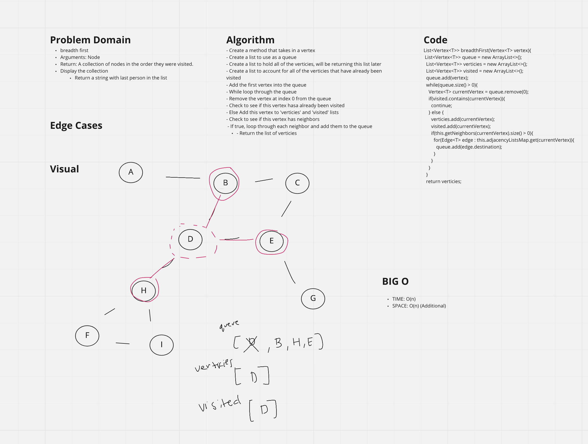

# Graph
<!-- Short summary or background information -->

- Graph:
  - A graph is a data structure for storing connected data like a network of people on a social media platform.
  - A graph consists of vertices and edges. A vertex represents the entity (for example, people) and an edge represents the relationship between entities (for example, a person's friendships).

## Challenge
<!-- Description of the challenge -->

Implement a Hashtable Class with the following methods:
- add node
  - Arguments: value
  - Returns: The added node
  - Add a node to the graph
- add edge
  - Arguments: 2 nodes to be connected by the edge, weight (optional)
  - Returns: nothing
  - Adds a new edge between two nodes in the graph
  - If specified, assign a weight to the edge
  - Both nodes should already be in the Graph
- get nodes
  - Arguments: none
  - Returns all of the nodes in the graph as a collection (set, list, or similar)
- get neighbors
  - Arguments: node
  - Returns a collection of edges connected to the given node
  - Include the weight of the connection in the returned collection
- size
  - Arguments: none
  - Returns the total number of nodes in the graph

## Approach & Efficiency
<!-- What approach did you take? Why? What is the Big O space/time for this approach? -->

### Approach

#### Graph

- Create a 'Graph' class

##### addNode((T value)

- Create a new vertex
- Create a new adjacency list (linked list)
- Add these two pieces of data to the adjacencyListMap using the new vertex as a key and the adjacency list as a value

##### getNodes()

- Retrieves all of the nodes (keys) of this graph

##### addEdge(Vertex<T> sourceVertex, Vertex<T> destinationVertex, int weight)

- Create a new edge with the set parameters
  - Source Vertex
  - Destination Vertex
  - Weight
- Go into the adjacency list map and call a `.get()` with the source vertex
- Add this new edge to the retrieved adjacency list

##### getNeighbors(Vertex<T> sourceVertex)

- Retrieve the value using the sourceVertex
- Retrieve the values and return each vertex and their weight from the source vertex

##### size

- Return the size of the graph

## API
<!-- Description of each method publicly available to your Linked List -->

### Big O

- Graph:
  - SPACE: O(1)
  - TIME: O(1)

### HashMap

- `.addNode(T value)`
  - Adds a new node to the Graph
  - SPACE: O(1)
  - TIME: O(1)

- `.addEdge(Vertex<T> sourceVertex, Vertex<T> destinationVertex, int weight)`
  - Connects to vertices together
  - SPACE: O(1)
  - TIME: O(1)

- `getNodes()`
  - Retrieves all of the nodes
  - SPACE: O(n)
  - TIME: O(n)

- `.getNeighbors(Vertex<T> sourceVertex)`
  - Retrieve the neighbors of the given source vertex
  - SPACE: O(1)
  - TIME: O(1)

- `.size()`
  - Return the size of the graph
  - SPACE: O(1)
  - TIME: O(1)

## Whiteboard

