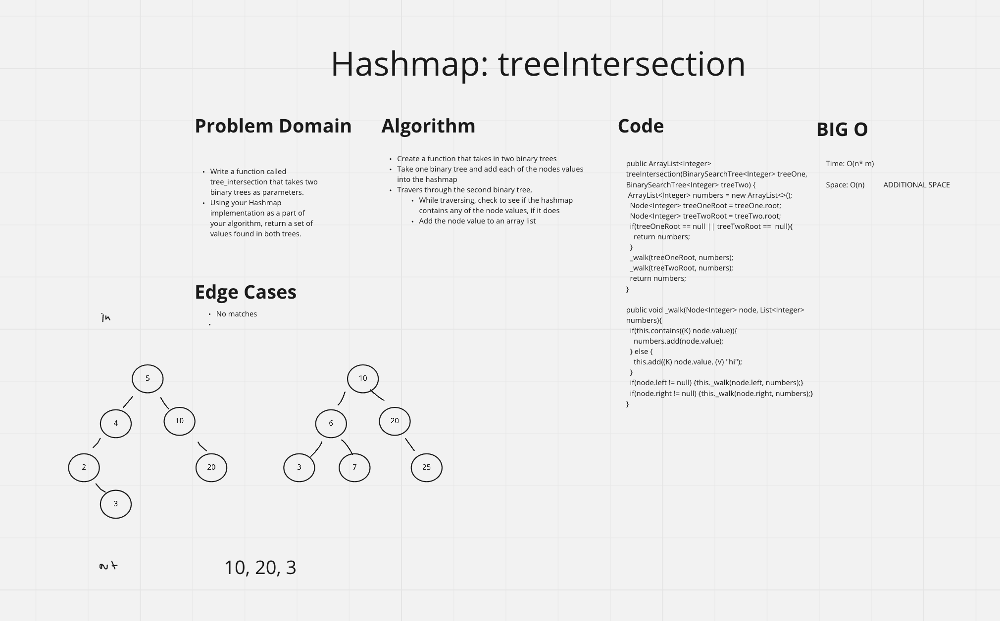

# Hash Table
<!-- Short summary or background information -->

- Binary Tree: A rooted binary tree, whose internal nodes each store a key; Each having two distinguished sub-trees (left and right)

## Challenge
<!-- Description of the challenge -->

Implement a Hashtable Class with the following methods:
- add
  - Arguments: key, value
  - Returns: nothing
  - This method should hash the key, and add the key and value pair to the table, handling collisions as needed.
- get
  - Arguments: key
  - Returns: Value associated with that key in the table
  contains
  - Arguments: key
  - Returns: Boolean, indicating if the key exists in the table already.
- hash
  - Arguments: key
  - Returns: Index in the collection for that key
- Write a function called tree_intersection that takes two binary trees as parameters.
- Using your Hashmap implementation as a part of your algorithm, return a set of values found in both trees.

## Approach & Efficiency
<!-- What approach did you take? Why? What is the Big O space/time for this approach? -->

### Approach

#### Hash Table

- Create a 'HashMap' class

##### add(K key, V value)

- Check to see if HashMap already contins key
  - If contains, throw IllegalArgumentException
- Hash key
- Select the bucket using the hashed key
- Append a HashMapPair using the key and value to the bucket

##### get(K)

- Hash key
- Select the bucket using the hashed key
- Start at the beginning node
- If the currentNode (which is a HashMapPair) check Key, if they passed in key matches, return value
- Else move on to the next node and perform the same check
- Return null if no matches

##### contains(K)

- Hash key
- Select the bucket using the hashed key
- Start at the beginning node
- If the currentNode (which is a HashMapPair) check Key, if they passed in key matches, return true
- Else move on to the next node and perform the same check
- Return null if no matches

##### reapeatingWords(K)

- Pass in string containg words as an argument
- Split string
- For each word in the array, check to see if hashmap contains the word, if true, return the word
- Else, add the word to the hashmap
- Return null
-
##### treeIntersection(K)

- Create a function that takes in two binary trees
- Take one binary tree and add each of the nodes values into the hashmap
- Travers through the second binary tree,
- While traversing, check to see if the hashmap contains any of the node values, if it does
- Add the node value to an array list

## API
<!-- Description of each method publicly available to your Linked List -->

### Big O

- HashMap:
  - SPACE: O(1)
  - TIME: O(1)

### HashMap

- `.add(K Key, V value)`
  - Adds a new value to the HashMap
  - SPACE: O(1)
  - TIME: O(1)

- `.get(K key)`
  - Retrieves a value from the HashMap with the given key
  - SPACE: O(1)
  - TIME: O(n)

- `.contains(K key)`
  - Check to see if the HashMap contains a key / value pair
  - SPACE: O(1)
  - TIME: O(n)

- `.repeatingWord(String string)`
  - Check to see if the HashMap contains a key / value pair
  - SPACE: O(1)
  - TIME: O(n)

- `.treeIntersction(BinarySearchTree<Integer> treeOne, BinarySearchTree<Integer> treeTwo)`
  - Check to see if the HashMap contains a key / value pair
  - SPACE: O(n)
  - TIME: O(n + m)

## Whiteboard

## Notes

- Based on Haustin Kimborough's code example today.
  - add, get, contains
- Working with Matthew Cho and Haustin Kimborough on `.repeatingWord()` method
