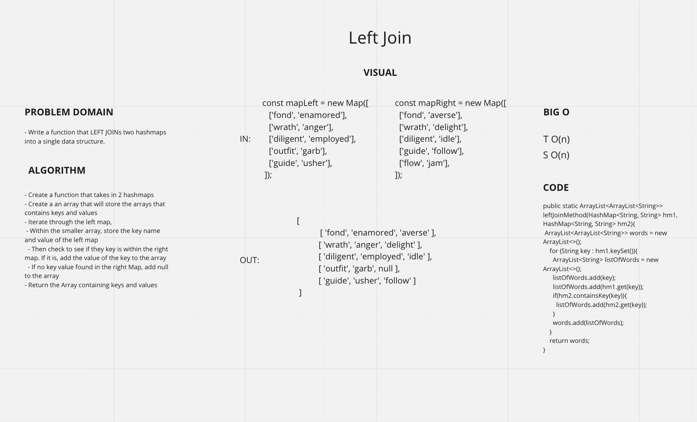

# Left Join
<!-- Short summary or background information -->

- Write a function that LEFT JOINs two hashmaps into a single data structure.

## Approach & Efficiency
<!-- What approach did you take? Why? What is the Big O space/time for this approach? -->

### Approach

#### .leftJoinMethod

- Create a function that takes in 2 hashmaps
- Create a an array that will store the arrays that contains keys and values
- Iterate through the left map,
- Within the smaller array, store the key name and value of the left map
- Then check to see if they key is within the right map. If it is, add the value of the key to the array
- If no key value found in the right Map, add null to the array
- Return the Array containing keys and values

## API
<!-- Description of each method publicly available to your Linked List -->

### Big O

- .leftJoinMethod:
  - SPACE: O(n)
  - TIME: O(n)

## Whiteboard

