# Sorting Methods

## Insertion Sort

- First we start with an unsorted list of integer

- The algorithm starts by comparing the index of 1 with the index of 0
- If the index at i is less than the index at j then the two numbers swap

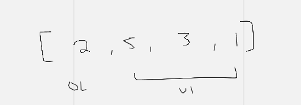
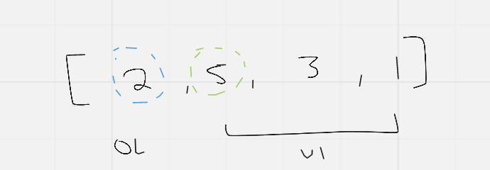

- Moving on to the next iteration
- As i gets bigger, j also gets bigger
- As long as j is greater than or equal to 0 AND value of index i is less than value at index j, the swap will happen
- We always start by comparing the index of i with the index of j and swap them if the index at i is less than the index of j
- It continues making comparisons like so

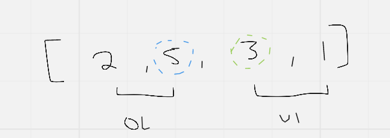
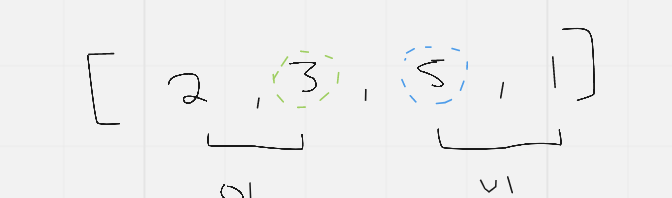
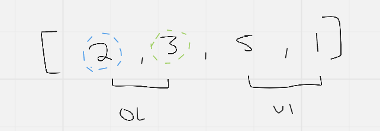
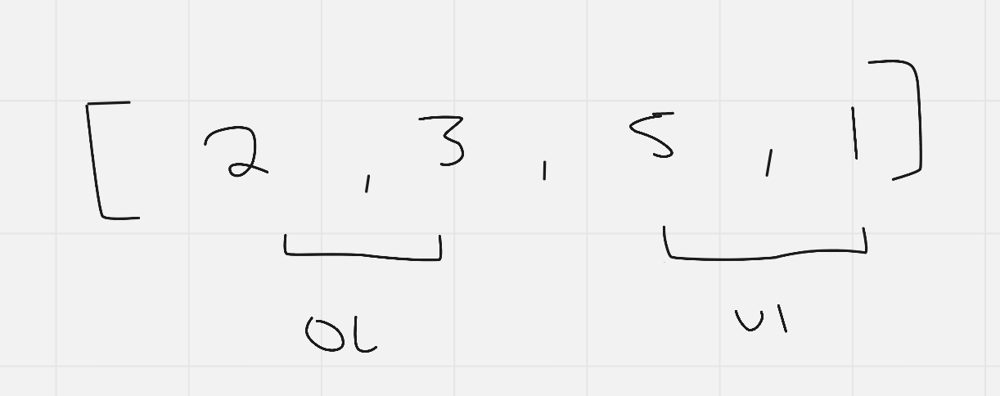

- This cycle repeats for every iteration of the array of integers until sorted

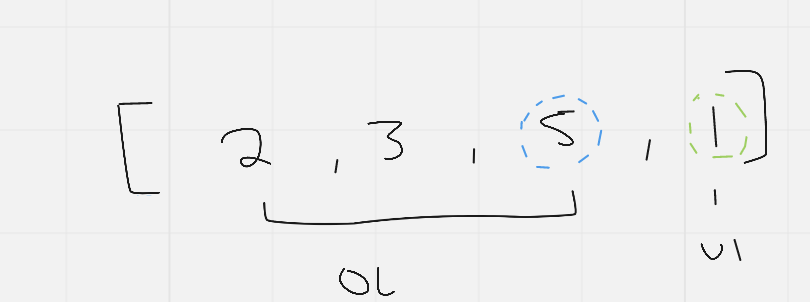
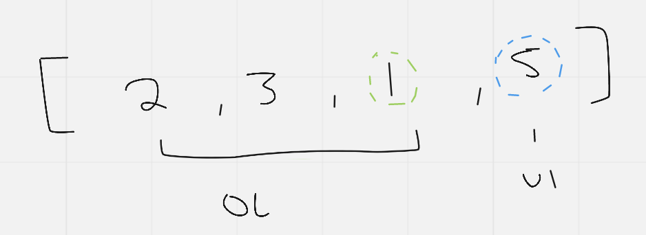
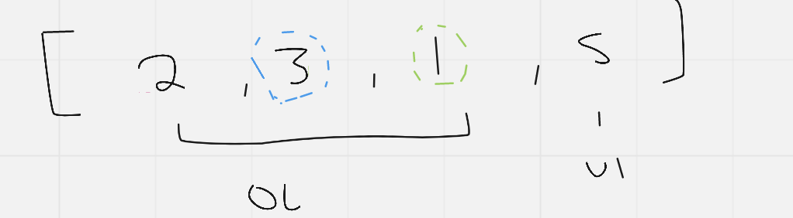
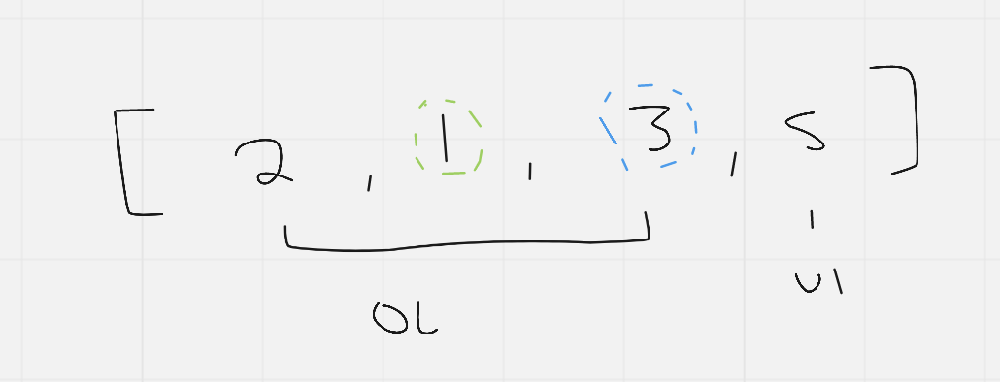
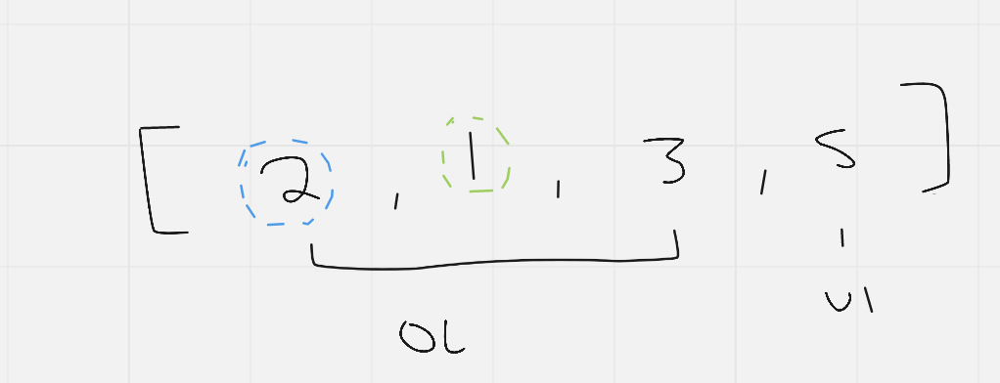
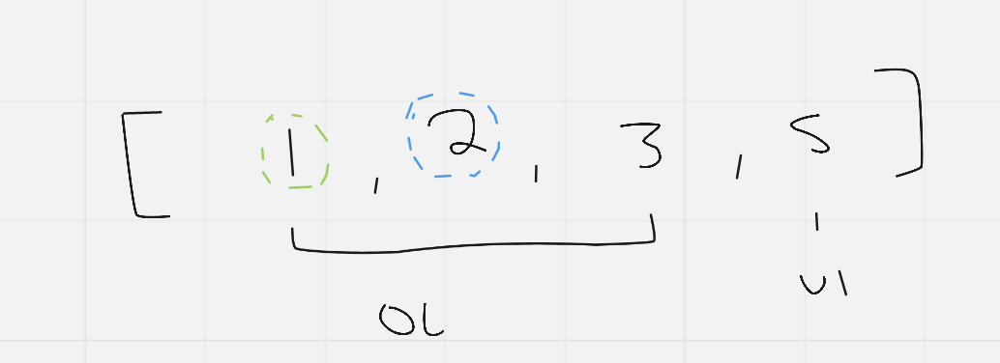
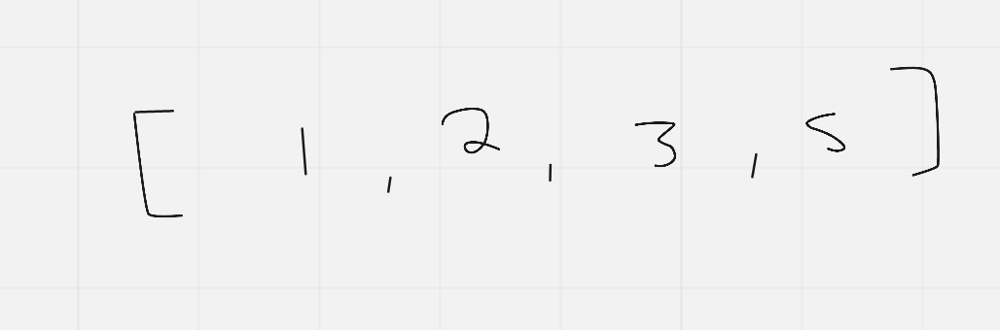

## Efficency

Time: O(n^2)
(Additional) Space: O(1)
