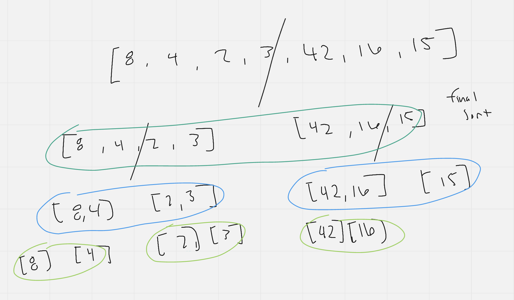

# Sorting Methods

# Merge Sort

- First we start with an unsorted list of integer
- The algorithm starts by dividing the array into smaller arrays using recursion, until arrays with only 1 item is made
- From here these individual arrays are merged together in numerical order, forming a new array.
- These newly formed arrays are then worked up the call stack, combining already merged and sorted arrays with other merged and sorted arrays until the array has been finally sorted

## Efficency

Time: O(Log n * n)
(Additional) Space: O(n)
