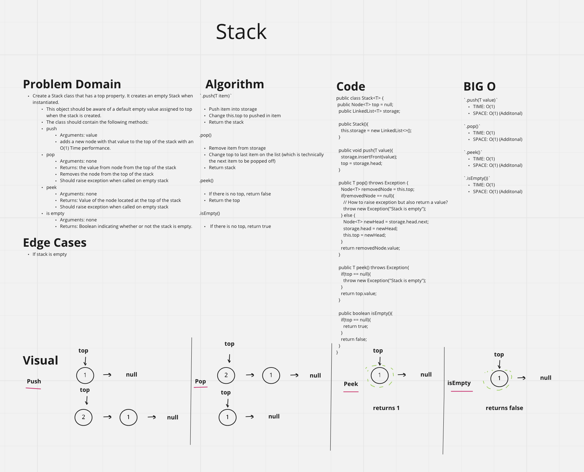
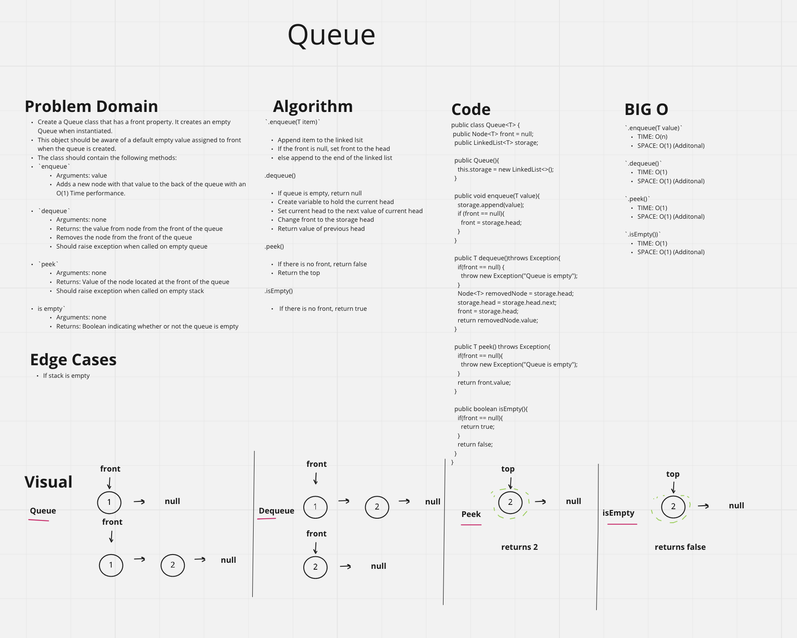
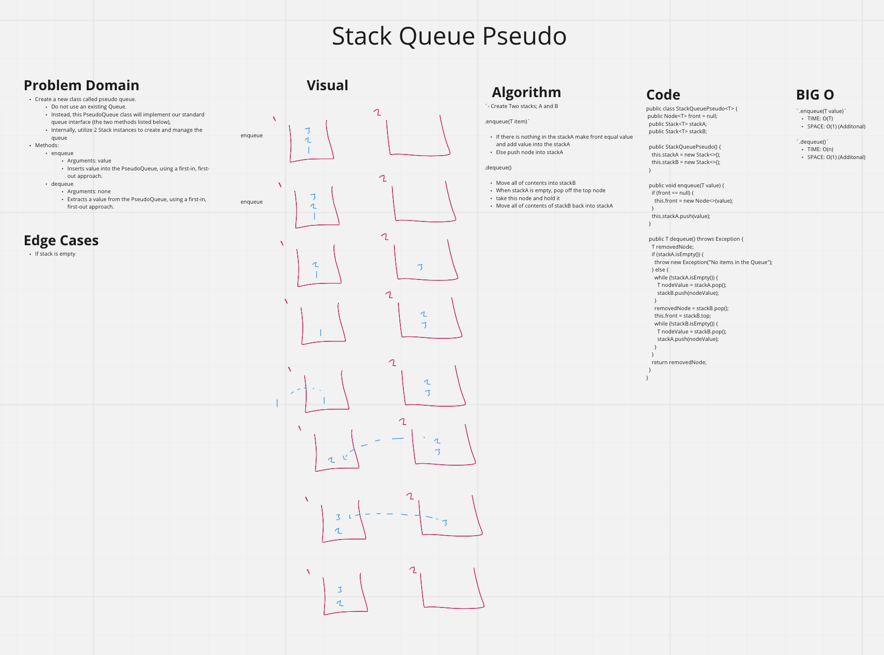
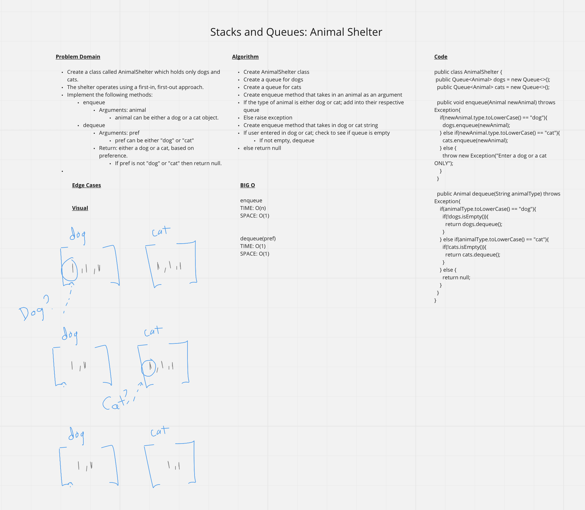

# Stacks and Queues
<!-- Short summary or background information -->
- Stack: Build a data structure that is built around a First in Last out concept
- Queue: Build a data structure that is built around a First in First out concept

## Challenge
<!-- Description of the challenge -->
- Using a Linked List as the underlying data storage mechanism, implement both a Stack and a Queue

### Stack

- Create a Stack class that has a top property. It creates an empty Stack when instantiated.
  - This object should be aware of a default empty value assigned to top when the stack is created.
  - The class should contain the following methods:
- `push`
  - Arguments: value
  - Adds a new node with that value to the top of the stack with an O(1) Time performance.
- `pop`
  - Arguments: none
  - Returns: the value from node from the top of the stack
  - Removes the node from the top of the stack
  - Should raise exception when called on empty stack

- `peek`
  - Arguments: none
  - Returns: Value of the node located at the top of the stack
  - Should raise exception when called on empty stack

- `is empty`
  - Arguments: none
  - Returns: Boolean indicating whether or not the stack is empty.

#### Approach & Efficiency
<!-- What approach did you take? Why? What is the Big O space/time for this approach? -->

- `.push(T value)`
  - Pushes item into the top of the storage
  - TIME: O(1)
  - SPACE: O(1)

- `.pop()`
  - Removes item at the top of the storage
  - TIME: O(1)
  - SPACE: O(1)

- `.peek()`
  - Retrieves item at the top of the storage
  - TIME: O(1)
  - SPACE: O(1)

- `.isEmpty())`
  - TIME: O(1)
  - SPACE: O(1)
  - checks to see if stack is empty

#### API
<!-- Description of each method publicly available to your Linked List -->

- Create a 'stack' class
- Create 'top' and 'storage' propreties as part of the constructor

##### `.push(T item)`

- Push item into storage
- Change this.top to pushed in item
- Return the stack

##### .pop()

- Remove item from storage
- Change top to last item on the list (which is technically the next item to be popped off)
- Return stack

##### .peek()

- If there is no top, return false
- Return the top

##### .isEmpty()

- If there is no top, return true

### Queue

- Create a Queue class that has a front property. It creates an empty Queue when instantiated.
- This object should be aware of a default empty value assigned to front when the queue is created.
- The class should contain the following methods:
- `enqueue`
  - Arguments: value
  - Adds a new node with that value to the back of the queue with an O(1) Time performance.

- `dequeue`
  - Arguments: none
  - Returns: the value from node from the front of the queue
  - Removes the node from the front of the queue
  - Should raise exception when called on empty queue

- `peek`
  - Arguments: none
  - Returns: Value of the node located at the front of the queue
  - Should raise exception when called on empty stack

- `is empty`
  - Arguments: none
  - Returns: Boolean indicating whether or not the queue is empty

#### Approach & Efficiency

- `.enqueue(T value)`
  - Pushes item into the end of the queue
  - TIME: O(n)
  - SPACE: O(1)

- `.dequeue()`
  - Removes item at the front of the queue
  - TIME: O(1)
  - SPACE: O(1)

- `.peek()`
  - Retrieves item at the front of the queue
  - TIME: O(1)
  - SPACE: O(1)

- `.isEmpty())`
  - checks to see if queue is empty
  - TIME: O(1)
  - SPACE: O(1)

#### API

- Create a 'queue' class
- Create 'front', 'rear', 'storage' properties as part of the constructor

##### `.enqueue(item)`

- If there is nothing in the queue, return 'empty queue'
- remove item from the front of the list
- If length is 0, set both front and rear to null
- If there are items in queue, set front to the first item in the storage. set rear to the last item in the storage

##### `.dequeue()`

- Remove item from storage
- Change top to last item on the list (which is technically the next item to be popped off)
- Return value of dequeued node

##### `.peek()`

- If there is no front, return false
- Return the front

##### `.isEmpty()`

- If there is no front, return true; else return false.

#### StackQueuePseudo

- Create a new class called pseudo queue.
  - Do not use an existing Queue.
  - Instead, this PseudoQueue class will implement our standard queue interface (the two methods listed below),
  - Internally, utilize 2 Stack instances to create and manage the queue

- Methods:
  - enqueue
    - Arguments: value
    - Inserts value into the PseudoQueue, using a first-in, first-out approach.
  - dequeue
    - Arguments: none
    - Extracts a value from the PseudoQueue, using a first-in, first-out approach.

##### API

- `.enqueue(T item)`
  - If there is nothing in the stackA make front equal value and add value into the stackA
  - Else push node into stackA

- `.dequeue()`
  - Move all of contents into stackB
  - When stackA is empty, pop off the top node
  - Take this node and hold it
  - Move all of contents of stackB back into stackA

##### Approach & Efficiency

- `.enqueue(T value)`
  - Pushes item into the end of the queue
  - TIME: O(1)
  - SPACE: O(1)

- `.dequeue()`
  - Removes item at the front of the queue
  - TIME: O(n)
  - SPACE: O(1)

#### Animal Shelter

- Create a class called AnimalShelter which holds only dogs and cats.
- The shelter operates using a first-in, first-out approach.
- Implement the following methods:
- enqueue
  - Arguments: animal
    - animal can be either a dog or a cat object.
- dequeue
  - Arguments: pref
    - pref can be either "dog" or "cat"
  - Return: either a dog or a cat, based on preference.
    - If pref is not "dog" or "cat" then return null.

##### API

- `.enqueue(Animal)`
  - If the type of animal is either dog or cat; add into their respective queue
    Else raise exception

- `.dequeue(String dog/cat)`
  - Create dequeue method that takes in dog or cat string
  - If user entered in dog or cat; check to see if queue is empty
  - If not empty, dequeue
  - else return null

##### Approach & Efficiency

- `.enqueue(T value)`
  - Pushes item into the end of the queue
  - TIME: O(n)
  - SPACE: O(1)

- `.dequeue()`
  - Removes item at the front of the queue
  - TIME: O(1)
  - SPACE: O(1)

