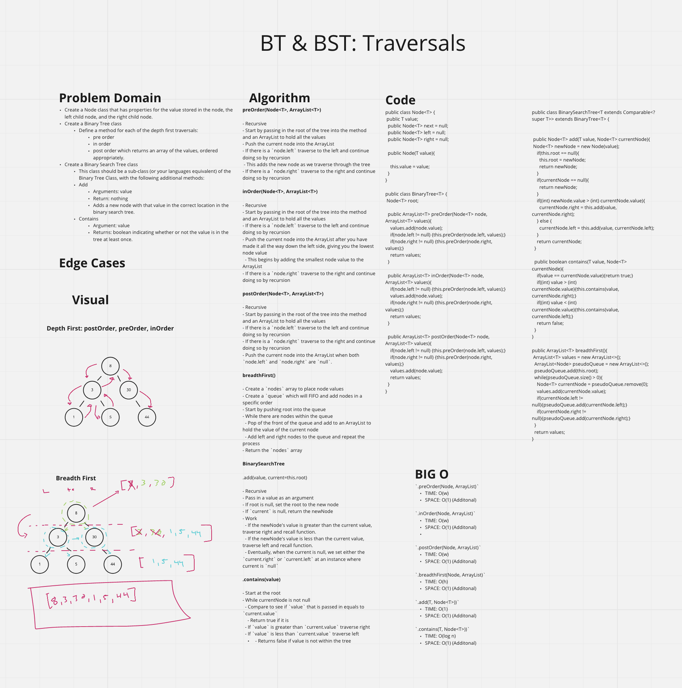
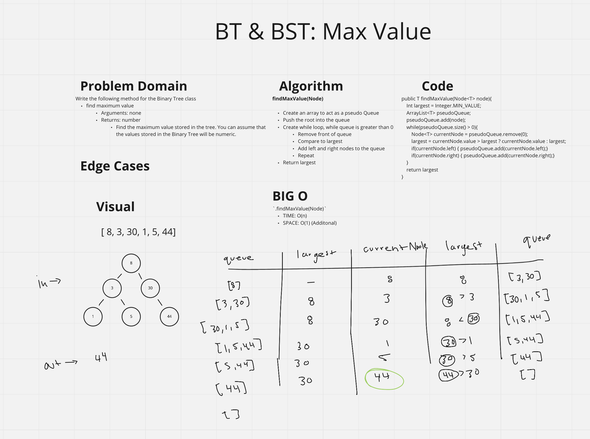

# Binary Tree / Binary Search Tree
<!-- Short summary or background information -->
- Binary Tree: A rooted binary tree, whose internal nodes each store a key; Each having two distinguished sub-trees (left and right)

## Challenge
<!-- Description of the challenge -->
- Create a BinaryTree class
  - Define a method for each of the depth first traversals called, `preOrder`, `inOrder`, and `postOrder` which returns an array of the values, ordered appropriately

- Create a BinarySearchTree class
  - Define a method named `add` that accepts a value, and adds a new node with that value in the correct location in the binary search tree.
  - Define a method named `contains` that accepts a value, and returns a boolean indicating whether or not the value is in the tree at least once.

## Approach & Efficiency
<!-- What approach did you take? Why? What is the Big O space/time for this approach? -->

### Approach

#### BinaryTree

- Create a 'BinaryTree' class
- Should have a `root` property

##### preOrder(Node<T>, ArrayList<T>)

- Recursive
- Start by passing in the root of the tree into the method and an ArrayList to hold all the values
- Push the current node into the ArrayList
- If there is a `node.left` traverse to the left and continue doing so by recursion
  - This adds the new node as we traverse through the tree
- If there is a `node.right` traverse to the right and continue doing so by recursion

##### inOrder(Node<T>, ArrayList<T>)

- Recursive
- Start by passing in the root of the tree into the method and an ArrayList to hold all the values
- If there is a `node.left` traverse to the left and continue doing so by recursion
- Push the current node into the ArrayList after you have made it all the way down the left side, giving you the lowest node value
  - This begins by adding the smallest node value to the ArrayList
- If there is a `node.right` traverse to the right and continue doing so by recursion

##### postOrder(Node<T>, ArrayList<T>)

- Recursive
- Start by passing in the root of the tree into the method and an ArrayList to hold all the values
- If there is a `node.left` traverse to the left and continue doing so by recursion
- If there is a `node.right` traverse to the right and continue doing so by recursion
- Push the current node into the ArrayList when both `node.left` and `node.right` are `null`.

##### breadthFirst()

- Create a `nodes` array to place node values
- Create a `queue` which will FIFO and add nodes in a specific order
- Start by pushing root into the queue
- While there are nodes within the queue
  - Pop of the front of the queue and add to an ArrayList to hold the value of the current node
  - Add left and right nodes to the queue and repeat the process
- Return the `nodes` array

#### BinarySearchTree

##### .add(value, current=this.root)

- Recursive
- Pass in a value as an argument
- If root is null, set the root to the new node
- If `current` is null, return the newNode
- Work
  - If the newNode's value is greater than the current value, traverse right and recall function.
  - If the newNode's value is less than the current value, traverse left and recall function.
  - Eventually, when the current is null, we set either the `current.right` or `current.left` at an instance where current is `null`

##### .contains(value)

- Start at the root
- While currentNode is not null
  - Compare to see if `value` that is passed in equals to `current.value`
    - Return true if it is
  - If `value` is greater than `current.value` traverse right
  - If `value` is less than `current.value` traverse left
  - Returns false if value is not within the tree

##### .findMax(Node)

- Create an array to act as a pseudo Queue
- Push the root into the queue
- Create while loop, while queue is greater than 0
  - Remove front of queue
  - Compare to largest
  - Add left and right nodes to the queue
  - Repeat
- Return largest

## API
<!-- Description of each method publicly available to your Linked List -->

### Big O

- Binary Tree:
  - SPACE: O(1)
  - TIME: O(1)

- Binary Search Tree:
  - SPACE: O(1)
  - TIME: O(1)

### Binary Tree

- `.preOrder(node, nodes=[])`
  - prints out nodes at the initial point of changes with priority from the left to the right
  - SPACE: O(h)
  - TIME: O(n)

- `.inOrder(node, nodes=[])`
  - prints out nodes in order
  - SPACE: O(h)
  - TIME: O(n)

- `.postOrder(node, nodes=[])`
  - prints out nodes from left to right starting at the highest row
  - SPACE: O(w)
  - TIME: O(n)

- `.breadthFirst()`
  - prints out nodes from left to right starting at the root
  - SPACE: O(w)
  - TIME: O(n)

### Binary Search Tree

- `.add(value, current=this.root)`
  - Adds a node to the tree
  - SPACE: O(1)
  - TIME: O(n)

- `.contains(value)`
  - Verifies to see if node is in the tree
  - SPACE: O(1)
  - TIME: O(n)

- `.findMax(Node)`
  - Finds the MAX value in a tree
  - SPACE: O(1)
  - TIME: O(n)

