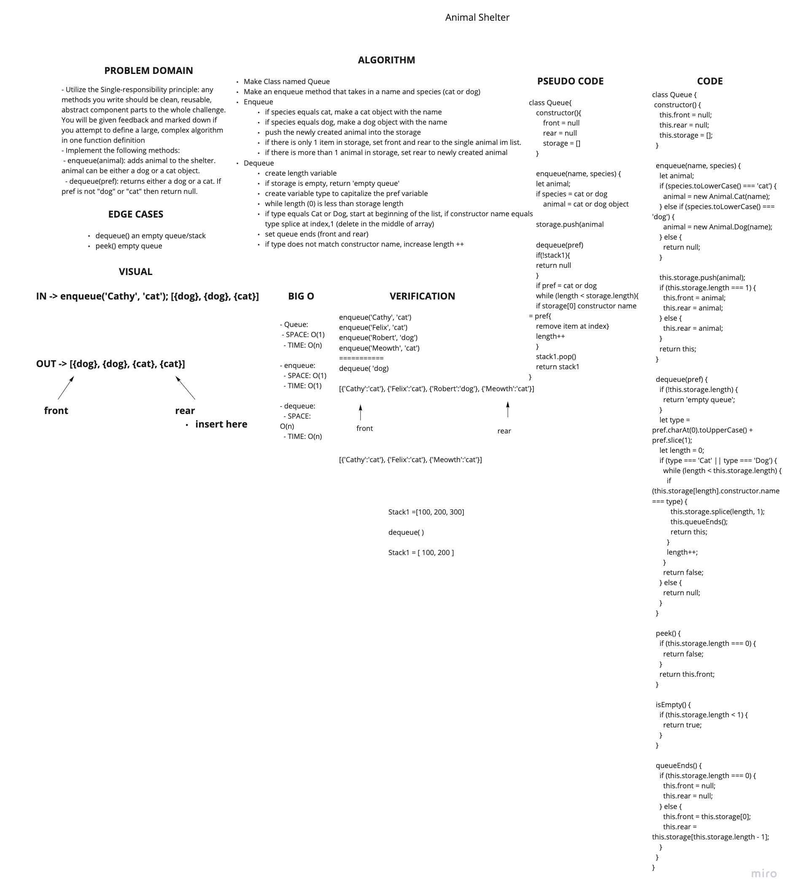

# Stack and Queue
<!-- Short summary or background information -->
- Stack: Build a data structure that is built around a First in Last out concept

## Challenge
<!-- Description of the challenge -->
- Utilize the Single-responsibility principle: any methods you write should be clean, reusable, abstract component parts to the whole challenge. You will be given feedback and marked down if you attempt to define a large, complex algorithm in one function definition
- Implement the following methods:
  - enqueue(animal): adds animal to the shelter. animal can be either a dog or a cat object.
  - dequeue(pref): returns either a dog or a cat. If pref is not "dog" or "cat" then return null.

## Approach & Efficiency
<!-- What approach did you take? Why? What is the Big O space/time for this approach? -->

### Approach

#### Animal

##### Cat

- class to make a `Cat` object

##### Dog

- class to make a `Dog` object

#### Queue

- create a 'queue' class
- create 'front', 'rear', 'storage' propreties as part of the constructor

##### .enqueue(name, species)

- create animal variable
- if parameter species === cat, create cat object || dog, create dog object
- if only 1 item in list, set front and rear of queue to this newly created animal otherwise, only make the rear this animal

##### .dequeue(pref)

- if storage is empty, return 'empty queue'
- if pref === cat or dog
  - traverse through the list starting at the front (index 0)
  - if class of object === type
  - deleted that object
  - reset front and rear
  - otherwise, increment length and continue while loop

##### .peek()

- if there is no top, return false
- return the top

##### .isEmpty()

- if length of storage is less than one (is empty || 0) return true

## API
<!-- Description of each method publicly available to your Linked List -->

### Big O

- Queue:
  - SPACE: O(1)
  - TIME: O(n)

- enqueue:
  - SPACE: O(1)
  - TIME: O(1)

- dequeue:
  - SPACE: O(n)
  - TIME: O(n)

- peek:
  - SPACE: O(1)
  - TIME: O(1)

- isEmpty:
  - SPACE: O(1)
  - TIME: O(1)

- queueEnds():
  - SPACE: O(1)
  - TIME: O(1)

### Queue

- `.enqueue(name, type)`
  - pushes item into the end of the queue

- `.dequeue(pref)`
  - removes item

- `.peek()`
  - retrieves item at the front of the queue

- `.isEmpty()`
  - checks to see if queue is empty

