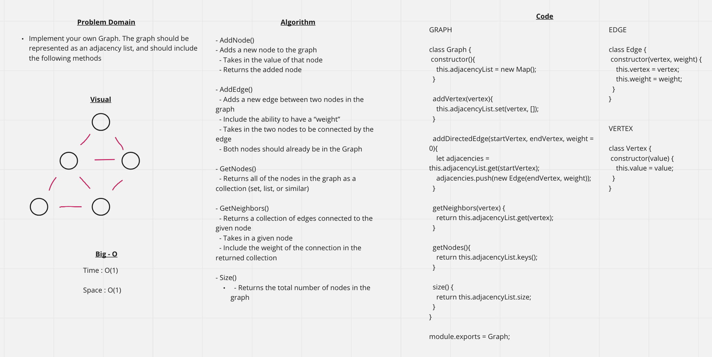

# Graph
<!-- Short summary or background information -->
Utilize the Single-responsibility principle: any methods you write should be clean, reusable, abstract component parts to the whole challenge. You will be given feedback and marked down if you attempt to define a large, complex algorithm in one function definition.

## Challenge
<!-- Description of the challenge -->
- Implement your own Graph. The graph should be represented as an adjacency list, and should include the following methods:

- AddNode()
  - Adds a new node to the graph
  - Takes in the value of that node
  - Returns the added node

- AddEdge()
  - Adds a new edge between two nodes in the graph
  - Include the ability to have a “weight”
  - Takes in the two nodes to be connected by the edge
  - Both nodes should already be in the Graph

- GetNodes()
  - Returns all of the nodes in the graph as a collection (set, list, or similar)

- GetNeighbors()
  - Returns a collection of edges connected to the given node
  - Takes in a given node
  - Include the weight of the connection in the returned collection

- Size()
  - Returns the total number of nodes in the graph

## Approach & Efficiency
<!-- What approach did you take? Why? What is the Big O space/time for this approach? -->

### Approach

#### Graph Constructor

- Create a 'Graph' class
- Give the constructor a property that is set to a new Map

##### addVertex(vertex)

- Set a vertex with an empty array to the adjacencyList

##### addDirectedEdge(startVertex, endVertex, weight = 0)

- Create a variable that holds the value of a given vertex.
- Should be an empty array
- Push a new edge to the value

##### getNeighbors(vertex)

- Returns the value of a Vertex (which is an array of edges)

##### getNodes()

- Retruns all the keys within the Graph

##### size()

- Retruns the size of the Graph

##### businessTrip(graph, arr)

- Set some variables
  - Variable to keep track of weight between verticies
  - Index
  - Neighbors of verticies
  - A Boolean to see if the neighbor is valid
- Loop through the passed in array
  - Obtain a list of the neighbors of the current index
  - For each of the neighbors, check to see if the next index of the array is a neighbor
  - If it is true, change the boolean statement to verify that the next index of the array is in face a neighbor and add the weight to the total
  - If the boolean statement wasnt triggered in the previous, then the trip is not possible.. return a false statement
- Continue on to the next item in the array and reset the boolean to false
- Return true when finished

#### Vertex

- Creates an Vertex object with a property of value

#### Edge

- Creates an Edge object with a 
- Give the Edge constructor the following properties:
- Vertex
- Weight

## API
<!-- Description of each method publicly available to your Linked List -->

### Big O

- Graph:
  - SPACE: O(1)
  - TIME: O(1)

- addVertex(vertex):
  - SPACE: O(1)
  - TIME: O(1)

- addDirectedEdge(startVertex, endVertex, weight = 0):
  - SPACE: O(1)
  - TIME: O(1)

- getNeighbors(vertex):
  - SPACE: O(1)
  - TIME: O(1)

- getNodes():
  - SPACE: O(1)
  - TIME: O(1)

- size():
  - SPACE: O(1)
  - TIME: O(1
 
- businessTrip(graph, arr):
  - SPACE: O(1)
  - TIME: O(n^2)
  
  

