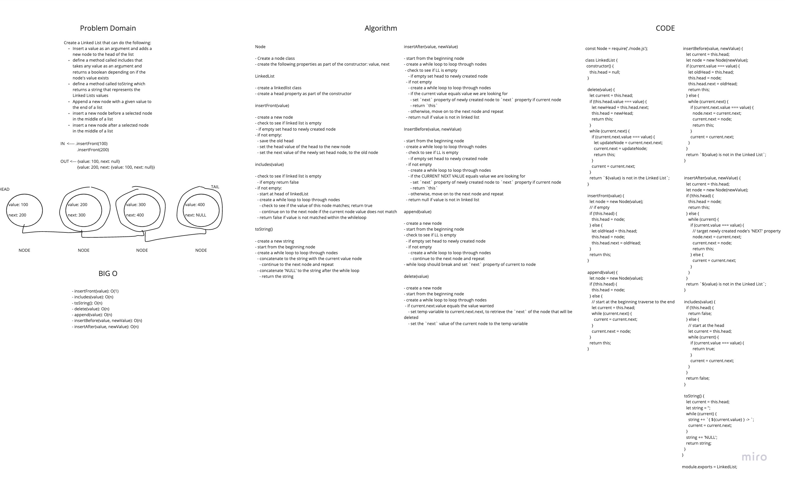
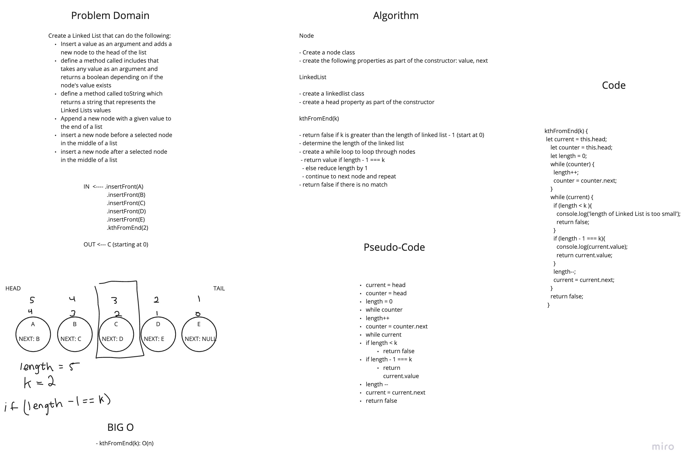

# Singly Linked List
<!-- Short summary or background information -->
- Represents series of nodes connected by pointer.
- Each node has a value and next property
- Linear Time

## Challenge
<!-- Description of the challenge -->
- Utilize the Single-responsibility principle: any methods you write should be clean, reusable, abstract component parts to the whole challenge. You will be given feedback and marked down if you attempt to define a large, complex algorithm in one function definition

## Approach & Efficiency
<!-- What approach did you take? Why? What is the Big O space/time for this approach? -->
### Approach

#### Node

- Create a node class
- create the following properties as part of the constructor: value, next

#### LinkedList

- create a linkedlist class
- create a head property as part of the constructor

##### insertFront(value)

- create a new node
- check to see if linked list is empty
  - if empty set head to newly created node
- if not empty:
  - save the old head
  - set the head value of the head to the new node
  - set the next value of the newly set head node, to the old node

##### includes(value)

- check to see if linked list is empty
  - if empty return false
- if not empty:
  - start at head of linkedList
  - create a while loop to loop through nodes
    - check to see if the value of this node matches; return true
    - continue on to the next node if the current node value does not match
  - return false if value is not matched within the whileloop

##### toString()

- create a new string
- start from the beginning node
- create a while loop to loop through nodes
  - concatenate to the string with the current value node
    - continue to the next node and repeat
  - concatenate 'NULL' to the string after the while loop
    - return the string

##### insertAfter(value, newValue)

- start from the beginning node
- create a while loop to loop through nodes
  - check to see if LL is empty
    - if empty set head to newly created node
  - if not empty
    - create a while loop to loop through nodes
    - if the current value equals value we are looking for
      - set `next` property of newly created node to `next` property if current node
      - return `this`
    - otherwise, move on to the next node and repeat
  - return null if value is not in linked list

##### insertBefore(value, newValue)

- start from the beginning node
- create a while loop to loop through nodes
  - check to see if LL is empty
    - if empty set head to newly created node
  - if not empty
    - create a while loop to loop through nodes
    - if the CURRENT NEXT VALUE equals value we are looking for
      - set `next` property of newly created node to `next` property if current node
      - return `this`
    - otherwise, move on to the next node and repeat
  - return null if value is not in linked list

##### append(value)

- create a new node
- start from the beginning node
- check to see if LL is empty
  - if empty set head to newly created node
  - if not empty
    - create a while loop to loop through nodes
      - continue to the next node and repeat
- while loop should break and set `next` property of current to node

##### delete(value)

- create a new node
- start from the beginning node
- create a while loop to loop through nodes
  - if current.next.value equals the value wanted
    - set temp variable to current.next.next, to retrieve the `next` of the node that will be deleted
    - set the `next` value of the current node to the temp variable

##### kthFromEnd(k)

- return false if k is greater than the length of linked list - 1 (start at 0)
- determine the length of the linked list
- create a while loop to loop through nodes
  - return value if length - 1 === k
  - else reduce length by 1
  - continue to next node and repeat
- return false if there is no match

### BIG O

- insertFront(value):
  - SPACE: O(1)
  - TIME: O(1)
  
- includes(value):
  - SPACE: O(n)
  - TIME: O(n)

- toString():
  - SPACE: O(n)
  - TIME: O(n)

- delete(value):
  - SPACE: O(n)
  - TIME: O(n)
  
- append(value):
  - SPACE: O(n)
  - TIME: O(n)

- insertBefore(value, newValue):
  - SPACE: O(n)
  - TIME: O(n)

- insertAfter(value, newValue):
  - SPACE: O(n)
  - TIME: O(n)

- kthFromEnd(k);
  - SPACE: O(n)
  - TIME: O(n)

## API
<!-- Description of each method publicly available to your Linked List -->
- `.insertFront(value)`
  - inserts a new node to the beginning of the string

- `.includes(value)`
  - checks to see if a node exists within the node lists

- `.toString()`
  - displays the node values

- `.insertBefore(value, newValue)`
  - inserts a new node before the selected value

- `.insertAfter(value, newValue)`
  - inserts a new node after the selected value

- `.append(value)`
  - add a new node to the end of the loinked list

- `.delete(value)`
  - deletes the selected node

- `.kthFromEnd(k)`
  - print out value of node from given k value space away from the end of the linked list

## Collaborations

- Terrence Simms

