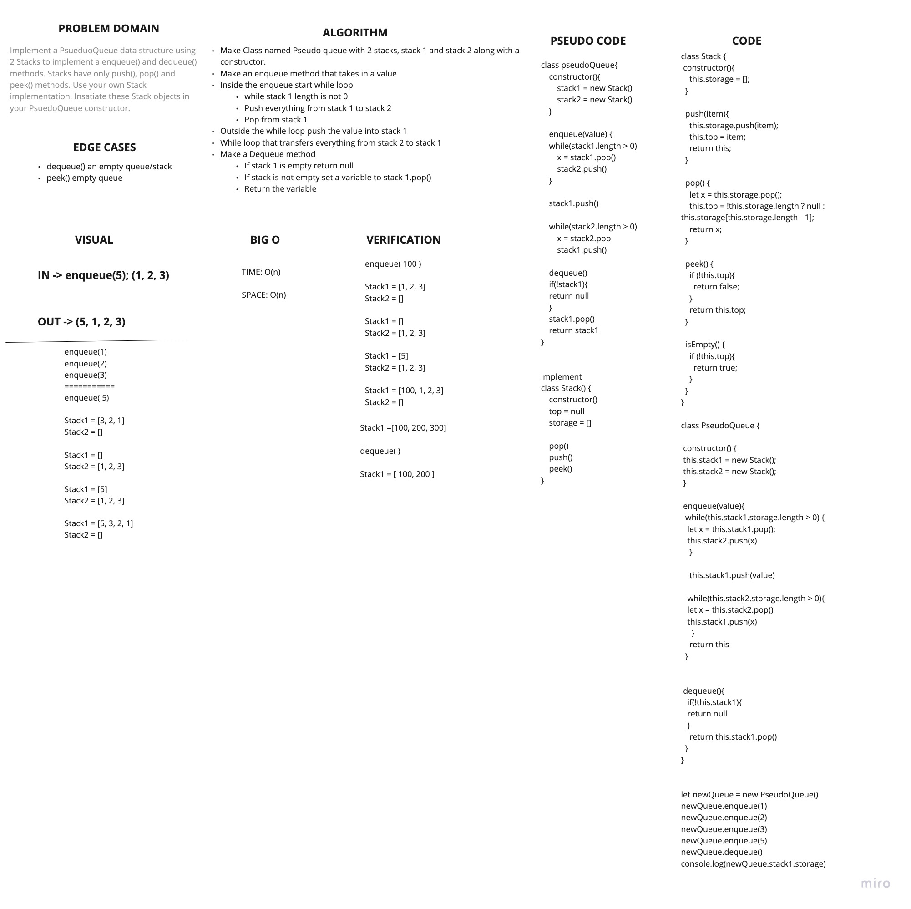

# Stack and Queue
<!-- Short summary or background information -->
- Queue: Build a data structure that is built around a First in First out concept

## Challenge
<!-- Description of the challenge -->
- Implement a PsueduoQueue data structure using 2 Stacks to implement a enqueue() and dequeue() methods. Stacks have only push(), pop() and peek() methods. Use your own Stack implementation. Insatiate these Stack objects in your PsuedoQueue constructor.

## Approach & Efficiency
<!-- What approach did you take? Why? What is the Big O space/time for this approach? -->

### Approach

#### Stack

- create a 'stack' class
- create 'top' and 'storage' propreties as part of the constructor

##### .push(item)

- push item into storage
- change this.top to pushed in item
- return the stack

##### .pop()

- remove item from storage
- change top to last item on the list (which is technically the next item to be popped off)
- return stack

##### .peek()

- return the first item in the queue

#### PseudoQueue

- create a 'PseudoQueue' class

##### .enqueue(item)

- if there is nothing in the queue, return 'null'
- if stack is not empty, while stack1 length is not 0
- push everything from stack1 to stack2
- add the item entered as an argument into stack1
- push contents from stack2 into back into stack1

##### .dequeue()

- if there is nothing in the queue, return 'null'
- if stack is not empty, set a variable to `stack1.pop()`
- return popped variable

## API
<!-- Description of each method publicly available to your Linked List -->

### Big O

- Queue:
  - SPACE: O(n)
  - TIME: O(n)

- Stack:
  - SPACE: O(1)
  - TIME: O(1)

### Stack

- `.push(item)`
  - pushes item into the top of the storage

- `.pop()`
  - removes item at the top of the storage

- `.peek()`
  - retrieves item at the front of the queue

### Queue

- `.enqueue(item)`
  - pushes item into the end of the queue

- `.dequeue()`
  - removes item at the front of the queue

