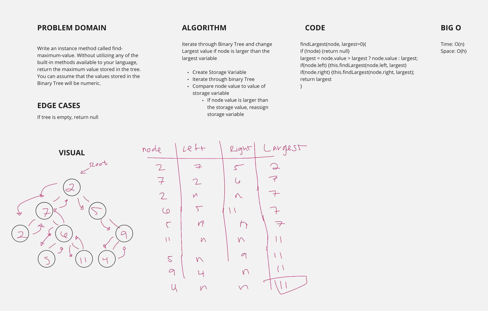

# Binary Tree / Binary Search Tree
<!-- Short summary or background information -->
- Binary Tree: A rooted binary tree, whose internal nodes each store a key; Each having two distinguished sub-trees (left and right)

## Challenge
<!-- Description of the challenge -->
- Create a BinaryTree class
  - Define a method for each of the depth first traversals called, `preOrder`, `inOrder`, and `postOrder` which returns an array of the values, ordered appropriately

- Create a BinarySearchTree class
  - Define a method named `add` that accepts a value, and adds a new node with that value in the correct location in the binary search tree.
  - Define a method named `contains` that accepts a value, and returns a boolean indicating whether or not the value is in the tree at least once.

## Approach & Efficiency
<!-- What approach did you take? Why? What is the Big O space/time for this approach? -->

### Approach

#### BinaryTree

- create a 'BinaryTree' class
- should have a `this.root = null` variable in constructor

##### preOrder(node, nodes=[])

- recursive
- start by passing in the root of the tree into the method
  - `newTree.preOrder(newTree.root)`
- push the current node into the default empty `nodes` array
- if there is a `node.left` traverse to the left and continue doing so by recursion
  - this adds the new node as we traverse through the tree
- if there is a `node.right` traverse to the right and continue doing so by recursion

##### inOrder(node, nodes=[])

- recursive
- start by passing in the root of the tree into the method
  - `newTree.preOrder(newTree.root)`
- if there is a `node.left` traverse to the left and continue doing so by recursion
- push the current node into the default empty `nodes` array after you have made it all the way down the left side, giving you the lowest node value
  - this begins by adding the smalles node value to the `nodes` list
- if there is a `node.right` traverse to the right and continue doing so by recursion

##### postOrder(node, nodes=[])

- recursive
- start by passing in the root of the tree into the method
  - `newTree.preOrder(newTree.root)`
- if there is a `node.left` traverse to the left and continue doing so by recursion
- if there is a `node.right` traverse to the right and continue doing so by recursion
- push the current node into the default empty `nodes` array when both `node.left` and `node.right` are `null`.

#### BinarySearchTree

##### .add(value, current=this.root)

- recursive
- pass in a value as an argument
- if `this.root` is null, set the root to the new node
- if `current` is null, return the newNode
- Work
  - if the newNode's value is greater than the current value, traverse right and recall function.
  - if the newNode's value is less than the current value, traverse left and recall function.
  - eventually, when the current is null, we set either the `current.right` or `current.left` at an instance where current is `null`

##### .contains(value)

- start at the root
- while current
  - compare to see if `value` that is passed in equals to `current.value`
    - return true
  - if `value` is greater than `current.value` traverse right
  - if `value` is less than `current.value` traverse left
  - returns false if value is not within the tree

##### .findMaximumValue(node, largest=0)

- use logic similar to finding breadthFirst
- start by pushing the of a tree into the queue
- while there are nodes within the queue
  - pop of the front of the queue and compare the value to the largest variable
  - swap the value of largest if current node value is greater than the largest value
  - add left and right nodes to the queue and repeat the process
- return the largest node value

## API
<!-- Description of each method publicly available to your Linked List -->

### Big O

- Binary Tree:
  - SPACE: O(1)
  - TIME: O(1)

- Binary Search Tree:
  - SPACE: O(1)
  - TIME: O(1)

### Binary Tree

- `.preOrder(node, nodes=[])`
  - prints out nodes at the initial point of changes with priority from the left to the right
  - SPACE: O(h)
  - TIME: O(n)

- `.inOrder(node, nodes=[])`
  - prints out nodes in order
  - SPACE: O(h)
  - TIME: O(n)

- `.postOrder(node, nodes=[])`
  - prints out nodes from left to right starting at the highest row
  - SPACE: O(w)
  - TIME: O(n)

### Binary Search Tree

- `.add(value, current=this.root)`
  - adds a node to the tree
  - SPACE: O(1)
  - TIME: O(n)

- `.contains(value)`
  - verifies to see if node is in tree
  - SPACE: O(1)
  - TIME: O(n)

- `.findMaximumValue(node, largest=0)`
  - finds the maximum value within a the tree
  - SPACE: O(1)
  - TIME: O(n)
  

