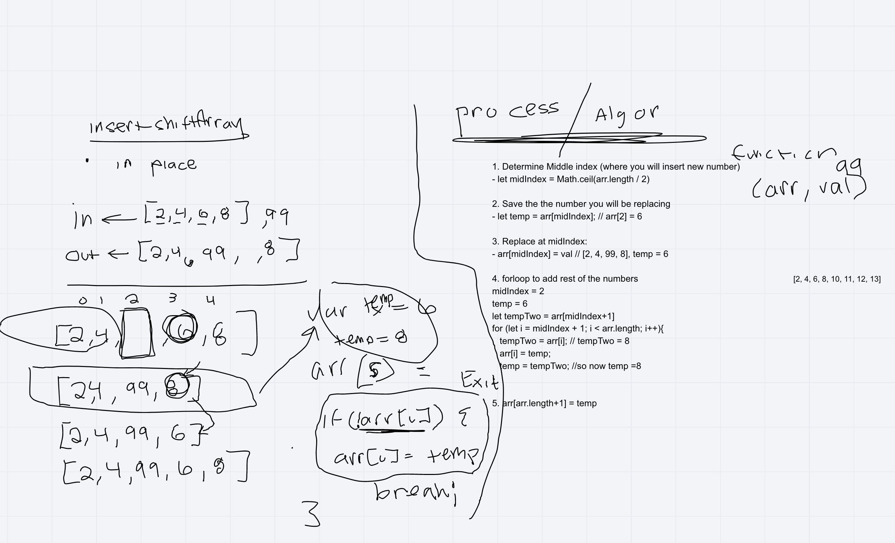

# Reverse an Array
<!-- Short summary or background information -->
- Write a function adds a number to the middle of the array
- Be careful of: empty arrays, arrays with only 1, odd numbered count, even numbered count

## Challenge
<!-- Description of the challenge -->

- We were tasked to write a function that inserts a value into the middle of an array. We were tasked to do this without using any built-in methods

## Approach & Efficiency
<!-- What approach did you take? Why? What is the Big O space/time for this approach? -->

- Determine the middle index (where you will insert the new number)
- Save the number you will be replacing
- Replace the number at the middle index
- For loop to add the rest of the numbers
- While looping, save the number youre about to replace, then replace it.
- Return array

## Solution
<!-- Embedded whiteboard image -->

