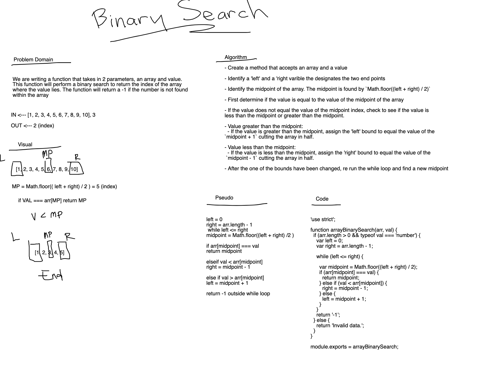

# Binary Search
<!-- Short summary or background information -->
- Use a binary search within an array to find a given value.
- Working with sorted and longer arrays, a Binary search is faster than a linear search
- By halving an array, the side where the value is not located is discarded halfing the search entierly and repeating the process until the value is found

## Challenge
<!-- Description of the challenge -->

- Write a function that takes in 2 parameters that takes in an array and a search key. This function will return an index of the array's element that equal the search key. If the search key is not in the array, return '-1'.

## Approach & Efficiency
<!-- What approach did you take? Why? What is the Big O space/time for this approach? -->

- Identify a 'left' and a 'right varible the designates the two end points
- Identify the midpoint of the array. The midpoint is found by `Math.floor((left + right) / 2)`
- First determine if the value is equal to the value of the midpoint of the array
- If the value does not equal the value of the midpoint index, check to see if the value is less than the midpoint or greater than the midpoint.
- Value greater than the midpoint:
  - If the value is greater than the midpoint, assign the 'left' bound to equal the value of the `midpoint + 1` cutting the array in half.
- Value less than the midpoint:
  - If the value is less than the midpoint, assign the 'right' bound to equal the value of the `midpoint - 1` cutting the array in half.
- After the one of the bounds have been changed, re run the while loop and find a new midpoint

## Solution
<!-- Embedded whiteboard image -->

