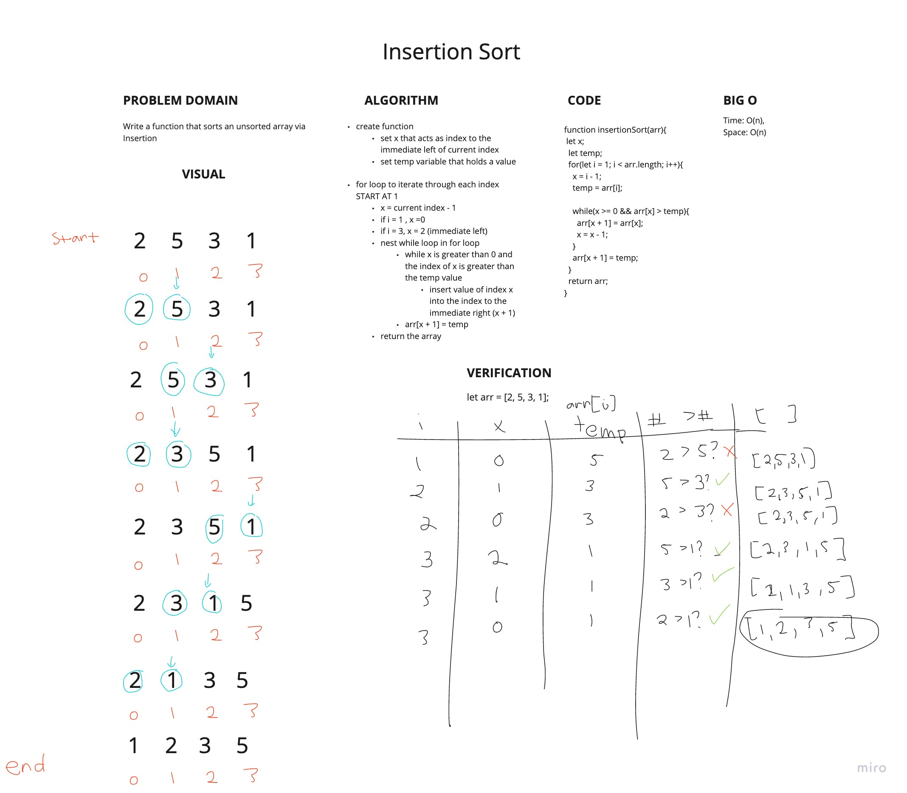

# Insertion Sort
<!-- Short summary or background information -->
- Build a function that sorts an unsorted array via insertion

## Challenge
<!-- Description of the challenge -->
- Review the pseudocode below, then trace the algorithm by stepping through the process with the provided sample array. Document your explanation by creating a blog article that shows the step-by-step output after each iteration through some sort of visual.

```javascript
  InsertionSort(int[] arr)
  
    FOR i = 1 to arr.length
    
      int j <-- i - 1
      int temp <-- arr[i]
      
      WHILE j >= 0 AND temp < arr[j]
        arr[j + 1] <-- arr[j]
        j <-- j - 1
        
      arr[j + 1] <-- temp
```

## Approach & Efficiency
<!-- What approach did you take? Why? What is the Big O space/time for this approach? -->

### Approach

- 

## API
<!-- Description of each method publicly available to your Linked List -->

### Big O

- insertionSort:
  - TIME: O(n)
  - SPACE: O(n)

- `.insertionSort(arr)`
  - Sorts an unsorted array

