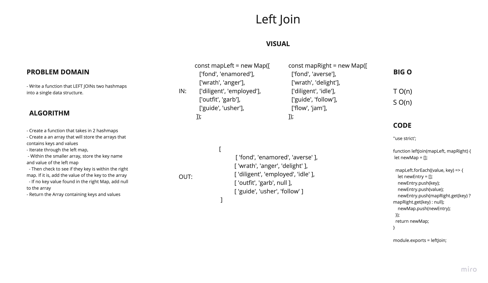

# Left Join
<!-- Short summary or background information -->
- Utilize the Single-responsibility principle: any methods you write should be clean, reusable, abstract component parts to the whole challenge. You will be given feedback and marked down if you attempt to define a large, complex algorithm in one function definition.

## Challenge
<!-- Description of the challenge -->
- Write a function that LEFT JOINs two hashmaps into a single data structure.
- The first parameter is a hashmap that has word strings as keys, and a synonym of the key as values.
- The second parameter is a hashmap that has word strings as keys, and antonyms of the key as values.
- Combine the key and corresponding values (if they exist) into a new data structure according to LEFT JOIN logic.
- LEFT JOIN means all the values in the first hashmap are returned, and if values exist in the “right” hashmap, they are appended to the result row. If no values exist in the right hashmap, then some flavor of NULL should be appended to the result row.
- The returned data structure that holds the results is up to you. It doesn’t need to exactly match the output below, so long as it achieves the LEFT JOIN logic.
- Avoid utilizing any of the library methods available to your language.
- Write at least three test assertions for each method that you define.
- Ensure your tests are passing before you submit your solution.

## Approach & Efficiency
<!-- What approach did you take? Why? What is the Big O space/time for this approach? -->

### Approach

- Create a function that takes in 2 hashmaps
- Create a an array that will store the arrays that contains keys and values
- Iterate through the left map,
  - Within the smaller array, store the key name and value of the left map
  - Then check to see if they key is within the right map. If it is, add the value of the key to the array
  - If no key value found in the right Map, add null to the array
- Return the Array containing keys and values

## API
<!-- Description of each method publicly available to your Linked List -->

### Big O

- leftJoin(mapLeft, mapRight):
  - TIME: O(n)
  - SPACE: O(n)

