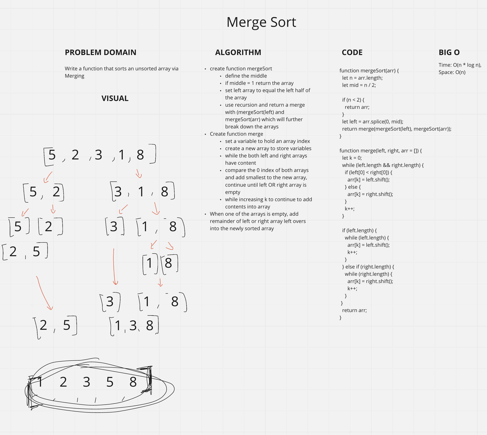

# Insertion Sort
<!-- Short summary or background information -->
- Build a function that sorts an unsorted array via merge

## Challenge
<!-- Description of the challenge -->
- Review the pseudocode below, then trace the algorithm by stepping through the process with the provided sample array. Document your explanation by creating a blog article that shows the step-by-step output after each iteration through some sort of visual.

- Once you are done with your article, code a working, tested implementation of Merge Sort based on the pseudocode provided.

```javascript
ALGORITHM Mergesort(arr)
    DECLARE n <-- arr.length
           
    if n > 1
      DECLARE mid <-- n/2
      DECLARE left <-- arr[0...mid]
      DECLARE right <-- arr[mid...n]
      // sort the left side
      Mergesort(left)
      // sort the right side
      Mergesort(right)
      // merge the sorted left and right sides together
      Merge(left, right, arr)

ALGORITHM Merge(left, right, arr)
    DECLARE i <-- 0
    DECLARE j <-- 0
    DECLARE k <-- 0

    while i < left.length && j < right.length
        if left[i] <= right[j]
            arr[k] <-- left[i]
            i <-- i + 1
        else
            arr[k] <-- right[j]
            j <-- j + 1
            
        k <-- k + 1

    if i = left.length
       set remaining entries in arr to remaining values in right
    else
       set remaining entries in arr to remaining values in left

```

## Approach & Efficiency
<!-- What approach did you take? Why? What is the Big O space/time for this approach? -->

### Approach

- Create function mergeSort
  - Define the middle
  - If middle = 1 return the array
  - Set left array to equal the left half of the array
  - Use recursion and return a merge with (mergeSort(left) and mergeSort(arr) which will further break down the arrays
- Create function merge
  - Set a variable to hold an array index
  - Create a new array to store variables
  - While the both left and right arrays have content
  - Compare the 0 index of both arrays and add smallest to the new array, continue until left OR right array is empty
  - While increasing k to continue to add contents into array
- When one of the arrays is empty, add remainder of left or right array left overs into the newly sorted array

## API
<!-- Description of each method publicly available to your Linked List -->

### Big O

- insertionSort:
  - TIME: O(n * log n )
  - SPACE: O(n)

- `.merge(left, right)`
  - Merges 2 arrays into 1 sorted array

- `.mergeSort(arr)`
  - Divides an array into 2 arrays

