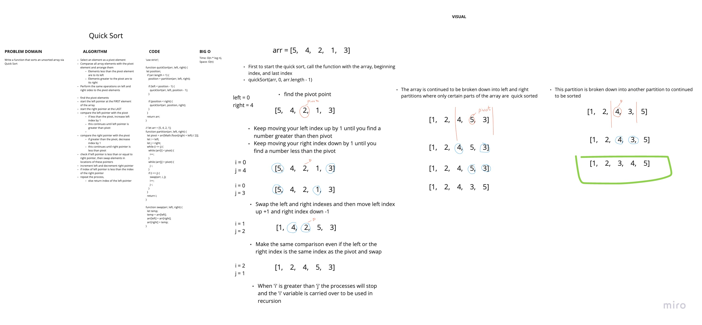

# Insertion Sort
<!-- Short summary or background information -->
- Build a function that sorts an unsorted array via merge

## Challenge
<!-- Description of the challenge -->
- Review the pseudocode below, then trace the algorithm by stepping through the process with the provided sample array. Document your explanation by creating a blog article that shows the step-by-step output after each iteration through some sort of visual.

- Once you are done with your article, code a working, tested implementation of Merge Sort based on the pseudocode provided.

```javascript
ALGORITHM QuickSort(arr, left, right)
    if left < right
        // Partition the array by setting the position of the pivot value 
        DEFINE position <-- Partition(arr, left, right)
        // Sort the left
        QuickSort(arr, left, position - 1)
        // Sort the right
        QuickSort(arr, position + 1, right)

ALGORITHM Partition(arr, left, right)
    // set a pivot value as a point of reference
    DEFINE pivot <-- arr[right]
    // create a variable to track the largest index of numbers lower than the defined pivot
    DEFINE low <-- left - 1
    for i <- left to right do
        if arr[i] <= pivot
            low++
            Swap(arr, i, low)

     // place the value of the pivot location in the middle.
     // all numbers smaller than the pivot are on the left, larger on the right. 
     Swap(arr, right, low + 1)
    // return the pivot index point
     return low + 1

ALGORITHM Swap(arr, i, low)
    DEFINE temp;
    temp <-- arr[i]
    arr[i] <-- arr[low]
    arr[low] <-- temp
```

## Approach & Efficiency
<!-- What approach did you take? Why? What is the Big O space/time for this approach? -->

### Approach

- Select an element as a pivot element
- Compare all array elements with the pivot element and arrange them
- Elements less than the pivot element are to its left
- Elements greater to the pivot are to its right
- Perform the same operations on left and right sides to the pivot elements

- find the pivot elements
- start the left pointer at the FIRST element of the array
- start the right pointer at the LAST
- compare the left pointer with the pivot
- if less than the pivot, increase left index by 1
- this continues until left pointer is greater than pivot

- compare the right pointer with the pivot
- if greater than the pivot, decrease index by 1
- this continues until right pointer is less than pivot
- check if left pointer is less than or equal to right pointer, then swap elements in locations of these pointers
- increment left and decrement right pointer
- if index of left pointer is less than the index of the right pointer
- repeat the process,
- else return index of the left pointer

## API
<!-- Description of each method publicly available to your Linked List -->

### Big O

- quickSort:
  - TIME: O(n * log n )
  - SPACE: O(n)

- `quickSort(arr, left, right)`
  - Takes in an array and partitions the array

- `partition(arr, left, right)`
  - Chooses a pivot and begins searching for elements greater than the pivot (on the left of the pivot) and elements less than the pivot (on the right of the pivot)
  - Once it has acquired 2 elements, swap the

- `swap(arr, i, low)`
  - Swaps 2 elements at the given indexes

