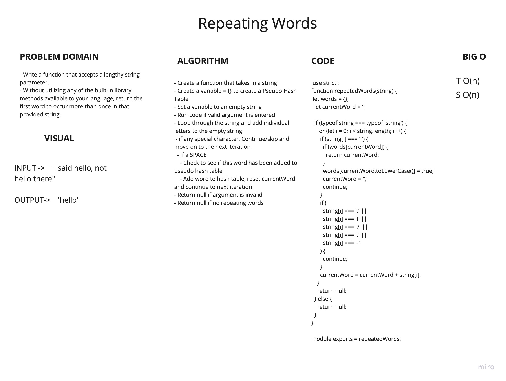

# Repeating Word
<!-- Short summary or background information -->
- Utilize the Single-responsibility principle: any methods you write should be clean, reusable, abstract component parts to the whole challenge. You will be given feedback and marked down if you attempt to define a large, complex algorithm in one function definition.

## Challenge
<!-- Description of the challenge -->
- Write a function that accepts a lengthy string parameter.
- Without utilizing any of the built-in library methods available to your language, return the first word to occur more than once in that provided string.

## Approach & Efficiency
<!-- What approach did you take? Why? What is the Big O space/time for this approach? -->

### Approach

- Create a function that takes in a string
- Create a variable = {} to create a Pseudo Hash Table
- Set a variable to an empty string
- Run code if valid argument is entered
- Loop through the string and add individual letters to the empty string
  - if any special character, Continue/skip and move on to the next interation
  - If a SPACE
    - Check to see if this word has been added to pseudo hashtable
    - Add word to hash table, reset currentWord and continue to next iteration
- Return null if argument is invalid
- Return null if no repeating words

## API
<!-- Description of each method publicly available to your Linked List -->

### Big O

- repeatedWords:
  - TIME: O(n)
  - SPACE: O(n)

- Collaborated with Mark Duenas, Terrence Sims, and Arthur Lozano
