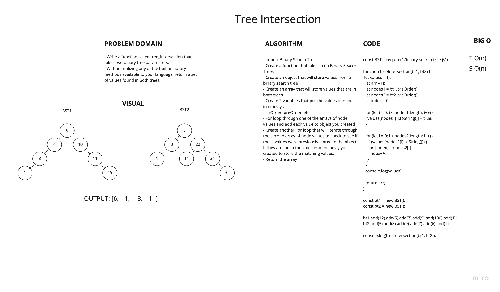

# Tree Intersection
<!-- Short summary or background information -->
- Utilize the Single-responsibility principle: any methods you write should be clean, reusable, abstract component parts to the whole challenge. You will be given feedback and marked down if you attempt to define a large, complex algorithm in one function definition.

## Challenge
<!-- Description of the challenge -->
- Write a function called tree_intersection that takes two binary tree parameters.
- Without utilizing any of the built-in library methods available to your language, return a set of values found in both trees.

## Approach & Efficiency
<!-- What approach did you take? Why? What is the Big O space/time for this approach? -->

### Approach

- Import Binary Search Tree
- Create a function that takes in (2) Binary Search Trees
- Create an object that will store values from a binary search tree
- Create an array that will store values that are in both trees
- Create 2 variables that put the values of nodes into arrays
  - inOrder, preOrder, etc..
- For loop through one of the arrays of node values and add each value to object you created
- Create another For loop that will iterate through the second array of node values to check to see if these values were previously stored in the object. If they are, push the value into the array you created to store the matching values.
- Return the array

## API
<!-- Description of each method publicly available to your Linked List -->

### Big O

- treeIntersection:
  - TIME: O(n)
  - SPACE: O(n)

